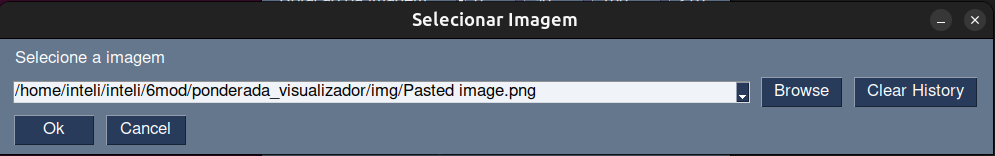
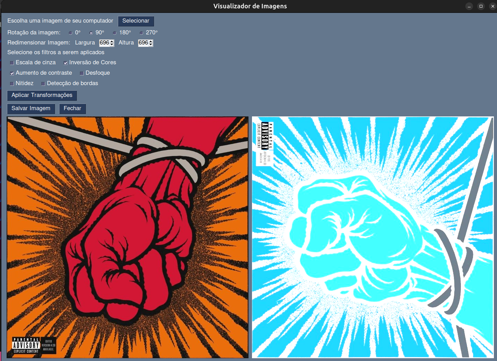
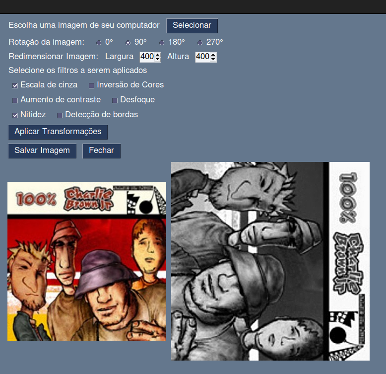
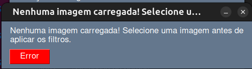

# Visualizador de Imagens

Este projeto consiste em um visualizador de imagens que permite a escolha de uma imagem e a aplicação de diferentes filtros e transformações nela.

## Ferramentas utilizadas

- [Python 3](https://www.python.org/)
- [PySimpleGUI](https://pysimplegui.readthedocs.io/en/latest/) – para construção da interface gráfica
- [OpenCV](https://opencv.org/) - para processamento e transformação de imagens

## Explicação do desenvolvimento

A explicação de como esse projeto foi desenvolvido está neste [vídeo]().

## Instruções de execução

Para executar o projeto utilizando o terminal do Linux, siga os seguintes passos:

1. Clone o repositório:

```bash
git clone https://github.com/SophiSenne/visualizador_imagens.git
```

2. Acesse o diretório do projeto:

```bash
cd visualizador_imagens
```

3. Crie um ambiente virtual e ative-o:

```bash
python3 -m venv venv
source venv/bin/activate
```

4. Instale as dependências:

```bash
pip install -r requirements.txt
```

5. Acesse a pasta `src`:

```bash
cd src
```

6. Execute o arquivo `main.py`:

```bash
python3 main.py
```

## Interface e Funcionamento

As figuras abaixo representam a inteface e suas funcionalidade, como a escolha da imagem, a rotação, o redimensionamento, a seleção de filtros e o salvamento da imagem editada. Além da mesngem de erro quando se tenta aplicar filtro sem selecionar uma imagem.

<div align="center">
<sup>Figura 1 - Visualização Inicial</sup>
<br>


<sup>Fonte: Material produzido pela autora (2025)</sup>
</div>

<div align="center">
<sup>Figura 2 - Seleção da Imagem</sup>
<br>


<sup>Fonte: Material produzido pela autora (2025)</sup>
</div>

<div align="center">
<sup>Figura 3 - Aplicação de filtros e transformações</sup>



<sup>Fonte: Material produzido pela autora (2025)</sup>
</div>

<div align="center">
<sup>Figura 4 - Aplicação de Filtros e Transformações para outra imagem</sup>



<sup>Fonte: Material produzido pela autora (2025)</sup>
</div>

<div align="center">
<sup>Figura 5 - Mensagem de erro</sup>
<br>


<sup>Fonte: Material produzido pela autora (2025)</sup>
</div>


## Funcionalidades

- Carregamento de imagem via seletor de arquivos

- Aplicação de múltiplos filtros:
    - Escala de cinza
    - Inversão de cores
    - Aumento de contraste
    - Desfoque
    - Nitidez
    - Detecção de bordas

- Transformações:
    - Rotação
    - Redimensionamento

- Visualização lado a lado (imagem original x imagem editada)

- Salvamento da imagem final

- Mensagens de erro